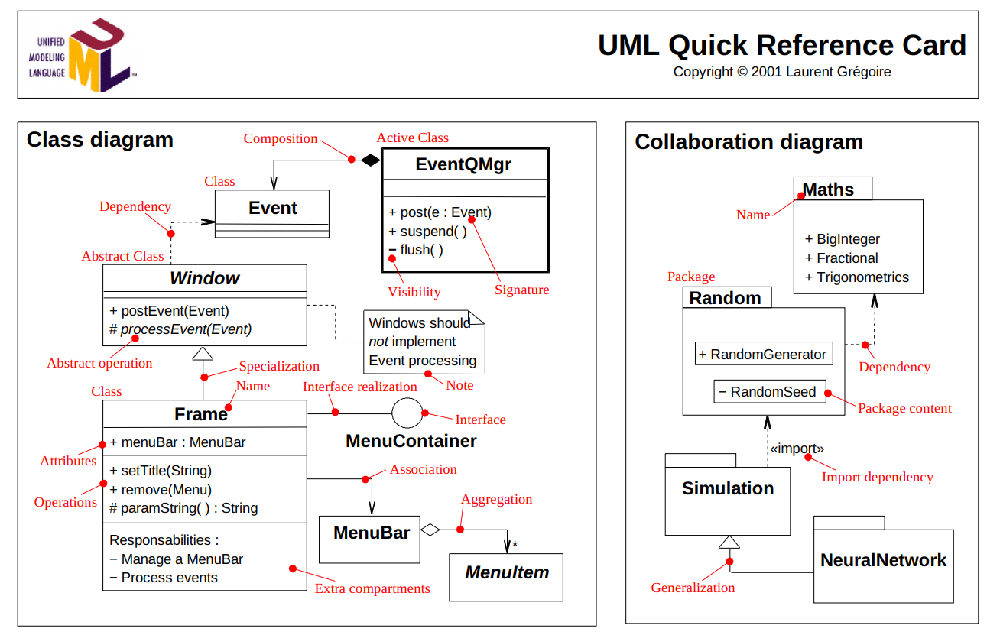

# Assignment 2: Answers

**Complete this document, commit your changes to Github and submit the repository URL to Canvas.** Keep your answers short and precise.

Your Name: Sebastian Chacon

Used free extension: [ ] 24 hrs or [ ] 48 hrs

[ ] Early submission (48 hrs)

[ ] Bonus work. Describe: ...

Place [x] for what applies.

## UML Diagram

Add your UML class diagram here.

Replace the following image with your diagram. You can draw it by hand and take a photo.

## Answers

1. How do you train the model and how do you classify a new tweet? Give a short description of the main steps.

    After tokenizing the tweet into individual words, I store them in a vector that then loops through and stores them into a sorted map. 
    The map uses a DSString as its key and maps to an int that is assigned 1 or -1 based off the value given to us in training. From then
    on every word that we find again we will do a +1/-1 system for every occurence. 

2. How long did your code take for training and what is the time complexity of your training implementation (Big-Oh notation)? Remember that training includes reading the tweets, breaking it into words, counting, ... Explain why you get this complexity (e.g., what does `N` stand for and how do your data structures/algorithms affect the complexity).

   > Your answer

3. How long did your code take for classification and what is the time complexity of your classification implementation (Big-Oh notation)? Explain why.

   > Your answer

4. How do you know that you use proper memory management? I.e., how do you know that you do not have
   a memory leak?

   > Your answer

5. What was the most challenging part of the assignment?

   > Your answer